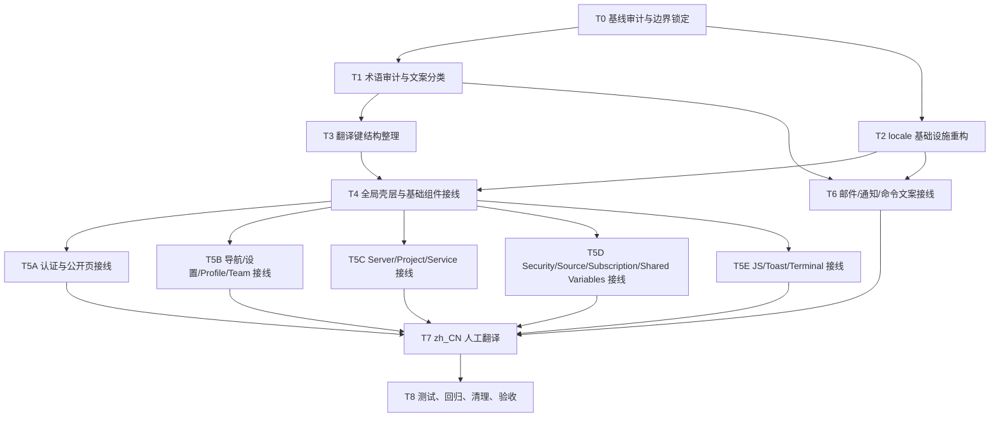

# Coolify 正式国际化改造执行计划（en / zh_CN）

## Summary
- 交付结果是一套符合 Laravel / Livewire 标准方式的国际化实现，支持 `en` 与 `zh_CN` 两种语言。
- 默认语言为 `zh_CN`，`fallback_locale` 为 `en`。
- 语言偏好只保存在 cookie 中；登录态与未登录态都使用同一套 locale 解析逻辑。
- 允许新增的界面变化只有“语言切换入口”。不新增页面，不删除页面，不删除组件，不减少任何现有交互。
- 文案翻译采用人工逐行处理。禁止机翻。
- 业务逻辑、鉴权、提交流程、数据结构、路由语义、组件结构保持原行为；国际化改造只改变“可见文案的来源”和“语言选择机制”。
- 实施顺序是：先审词与定规则，再接入标准 i18n，再做中文翻译，最后做回归验证。

## 执行原则
- 所有任务在独立 worktree 中并行进行；每个子代理只负责明确的文件范围和验收范围。
- 主代理负责：
  - 建立任务依赖与分发顺序；
  - 汇总术语规则；
  - 验收每个子任务的 diff、测试和实际行为；
  - 处理跨模块冲突；
  - 最终合并与清理。
- 子代理不得自行扩展范围，不得顺手改业务逻辑，不得把页面重做成新结构。
- 所有翻译改动都要优先保留变量、HTML、链接、命令、路径、环境变量、占位符、协议名和品牌名原样。
- 对“是否应翻译”存在疑义时，先保留英文并标记待审，不得自行硬译。

## 任务依赖图

## 推荐并行拓扑
- 主代理：负责任务编排、术语规则确认、冲突处理、最终验收。
- 子代理 A：`T1 + T3`，只读审词与翻译键结构整理方案，负责 `lang/en.json`、`lang/en/*.php` 的规范化设计。
- 子代理 B：`T2`，负责 locale 基础设施、配置、切换入口、cookie 与安全跳转。
- 子代理 C：`T4 + T5A`，负责基础布局、基础组件、认证与公开页。
- 子代理 D：`T5B`，负责导航、设置、Profile、Team、全局 UI 壳层。
- 子代理 E：`T5C`，负责 Server / Project / Service / Application 主业务页面。
- 子代理 F：`T5D + T6`，负责 Security / Source / Subscription / Shared Variables / 邮件 / 通知 / 命令主题。
- 子代理 G：`T5E`，负责 JS、toast、terminal、前端事件提示语。
- 子代理 H：`T7`，只在前述任务全部完成后启动，专门处理 `zh_CN` 人工翻译。
- 子代理 I：`T8`，与主代理配合做测试与行为回归；不负责写新功能。

## 任务拆解

### T0 基线审计与边界锁定
**目标**
- 给后续所有实现建立不会误伤业务的基线。

**内容**
- 盘点当前 locale 相关实现：
  - `ApplyLocale` 中间件；
  - `config/app.php`；
  - `routes/web.php` 里的语言切换入口；
  - `lang/*.json` 与 `lang/en/passwords.php`；
  - 已有 `__()` / `@lang()` / `trans()` 调用。
- 统计并记录以下清单：
  - 直接写在 Blade 中的英文文本；
  - 通过 props 传入组件的文案；
  - Livewire / JS 的 toast、错误、成功提示；
  - 邮件主题、正文、通知文案；
  - 命令中用户可见的主题与提示。
- 标记旧方案要移除的对象：
  - HTML 内容替换逻辑；
  - 自动抽词脚本；
  - 旧测试 `LocaleHtmlTranslationTest`。

**产出**
- 可执行的任务清单。
- 需要保留的业务行为清单。
- 需要覆盖的关键页面与链路清单。

**依赖**
- 无。

**并行性**
- 本任务必须先完成，再启动其他任务。

---

### T1 术语审计与文案分类
**目标**
- 给所有翻译建立统一术语边界，避免误译。

**内容**
- 从源码中提取并人工分类以下文案：
  - 必须翻译的界面文案；
  - 保留英文的品牌名、产品名、第三方服务名；
  - 保留原样的技术字面量；
  - 需要人工判定的术语。
- 建立术语基准表，至少覆盖高频词：
  - Coolify、Docker、Docker Compose、GitHub App、Cloudflare Tunnel、Traefik、Nixpacks、Hetzner、Webhook、API Token、MCP、Preview Deployment、SSH、Private Key、Proxy、Terminal、Shared Variables、Health Checks、Rollback、Swarm、FQDN、DNS、SSL。
- 明确以下规则：
  - 品牌名是否保留英文；
  - 复合术语是否中英混排；
  - 警告、错误、帮助说明的中文语气；
  - 标题、按钮、表单标签的长度风格；
  - 数据库引擎、代理、部署相关术语的统一翻法。

**产出**
- 术语表。
- 文案分类规则。
- 待人工判定词列表。

**依赖**
- `T0`。

**并行性**
- 可与 `T2` 并行。
- 完成后才能开始 `T3` 和 `T7`。

---

### T2 locale 基础设施重构
**目标**
- 建立标准 locale 解析与切换机制，不做 HTML 运行时替换。

**内容**
- `config/app.php`
  - `locale = 'zh_CN'`
  - `fallback_locale = 'en'`
  - 增加显式支持列表，仅 `en` 与 `zh_CN`
- locale 中间件：
  - 删除 HTML 正则替换逻辑；
  - 只保留 locale 解析、标准化与 `App::setLocale()`
  - 支持来源顺序：cookie -> `Accept-Language` -> 默认语言
- 语言切换路由：
  - 改为 `POST`
  - CSRF 保护
  - 只接受 `en` / `zh_CN`
  - 写长期 cookie
  - 仅允许站内回跳，外部地址回退到安全页面
- 语言切换入口：
  - 放在现有设置下拉中
  - 不新增页面、不新增独立设置页
- `lang/zh-cn.json` 迁移为 `lang/zh_CN.json`
- HTML `lang` 输出保持 `zh-CN` / `en`

**产出**
- 新 locale 基础设施。
- 安全的语言切换入口。

**依赖**
- `T0`。

**并行性**
- 可与 `T1` 并行。
- 完成后才能开始 `T4`、`T6`。

---

### T3 翻译键结构整理
**目标**
- 把翻译源整理成可维护结构，去掉噪声键和模板碎片。

**内容**
- 停用并移除自动抽词脚本。
- 清理 `lang/en.json` 中的伪键、模板片段、表达式、代码碎片。
- 建立分层规则：
  - 页面文案保留在 `lang/en.json`
  - 结构化文案拆到 `lang/en/*.php`
- 建议拆出的分组：
  - `navigation.php`
  - `actions.php`
  - `messages.php`
  - `toast.php`
  - `mail.php`
  - `forms.php`
- 统一 key 风格：
  - 同一类结构化文案使用命名 key
  - 页面长句允许继续用 JSON 原文 key
  - 避免英文原文 key 和短命名 key 在同一语义层混用

**产出**
- 干净的 `lang/en.json`
- 初始 `lang/en/*.php` 结构
- 对应的 `lang/zh_CN.*` 骨架

**依赖**
- `T1`。

**并行性**
- 完成后才能开始 `T4` 和 `T7`。

---

### T4 全局壳层与基础组件接线
**目标**
- 先把所有公共入口和基础组件切到显式取词模式，后续业务页才能批量迁移。

**内容**
- 处理布局与全局壳层：
  - 基础 layout
  - navbar
  - settings dropdown
  - 全局 modal
  - toast / popup
  - loading / status 组件
- 基础表单组件规则固定：
  - 组件自带静态文案由组件内部 `__()`
  - 调用方传入的 `title` / `buttonTitle` / `label` / `placeholder` / `helper` 视为已翻译文本
- 清理组件内硬编码英文：
  - 关闭按钮提示
  - 密码显隐按钮提示
  - 默认 modal 标题
  - 基础空状态和状态标签
- 处理无障碍文本：
  - `aria-label`
  - `alt`
  - `title`

**产出**
- 可供所有业务页复用的国际化基础组件层。

**依赖**
- `T2`、`T3`。

**并行性**
- 完成后可并行启动 `T5A` ~ `T5E`。

---

### T5A 认证与公开页接线
**范围**
- `auth/*`
- invitation
- errors
- 公开布局与登录相关提示

**内容**
- 把所有可见文案切到翻译源。
- 保留业务流程、验证、按钮行为、跳转逻辑不变。
- 检查 session status / error / validation error 的显示文本来源。

**依赖**
- `T4`。

**并行性**
- 与 `T5B`、`T5C`、`T5D`、`T5E` 并行。

---

### T5B 导航 / 设置 / Profile / Team 接线
**范围**
- 导航、设置页、Profile、Team、Admin View、Invite Link、Settings Email / OAuth / Backup / Updates / Advanced / Scheduled Jobs

**内容**
- 所有标题、tab、按钮、callout、表单项、帮助说明、弹窗文案改为显式取词。
- Livewire dispatch 的 success / error / warning / info 改为翻译源。
- 保持保存逻辑、权限、验证、Team 操作流程不变。

**依赖**
- `T4`。

**并行性**
- 与 `T5A`、`T5C`、`T5D`、`T5E` 并行。

---

### T5C Server / Project / Service / Application 主业务页接线
**范围**
- Server
- Project
- Service
- Application
- Database
- Destination
- Storage
- Boarding
- Global Search 中与主业务资源直接相关的界面

**内容**
- 将标题、按钮、状态、说明、空状态、表单标签、帮助提示、确认弹窗全部改为显式取词。
- 对以下术语严格按 `T1` 术语表处理：
  - Docker Compose
  - Preview Deployment
  - Swarm
  - Proxy
  - FQDN
  - Health Check
  - Webhook
  - Private Key
  - SSH
  - SSL
- 所有部署、重启、停止、删除、保存相关提示语只改文本来源，不改调用时机和分支逻辑。
- 含 HTML 的帮助文案保留 HTML 结构，翻译时只替换可见文本。

**依赖**
- `T4`。

**并行性**
- 与 `T5A`、`T5B`、`T5D`、`T5E` 并行。

---

### T5D Security / Source / Subscription / Shared Variables 接线
**范围**
- Security
- Source / GitHub / GitLab 相关页面
- Subscription
- Shared Variables
- Notifications 配置页

**内容**
- 处理所有配置页、授权提示、权限错误、帮助说明、确认弹窗。
- GitHub App / Cloudflare / Hetzner / OAuth / SMTP / Resend / Telegram / Slack / Discord / Pushover 等名称按术语表保留或中英混排。
- 含示例、token、URL、命令的文案只翻译自然语言部分。

**依赖**
- `T4`。

**并行性**
- 与 `T5A`、`T5B`、`T5C`、`T5E` 并行。

---

### T5E JS / Toast / Terminal 接线
**范围**
- `resources/js/terminal.js`
- Blade 里的 `Livewire.dispatch(...)`、`$dispatch(...)`
- clipboard、download、log copy 等前端交互提示

**内容**
- 建立前端只读翻译载荷，例如 `window.coolifyI18n`
- JS 中固定英文提示全部改为取该载荷的键
- Blade 内联脚本中的文案改为 `@js(__('...'))`
- 保持 websocket、terminal、copy、download、reconnect 等行为逻辑不变

**依赖**
- `T4`。

**并行性**
- 与 `T5A`、`T5B`、`T5C`、`T5D` 并行。

---

### T6 邮件 / 通知 / 命令文案接线
**目标**
- 让所有非页面链路也走正式翻译源。

**范围**
- `resources/views/emails/*`
- `app/Notifications/*`
- `app/Console/Commands/Emails.php`
- 其他直接构造主题或可见提示的命令 / notification channel

**内容**
- 邮件主题、正文标题、按钮、说明文本、告警文本改为显式取词。
- 请求内触发的通知 / 邮件显式带当前 locale。
- 无请求上下文的后台通知 / 邮件回退 `en`。
- 不新增用户 locale 字段，不改通知发送机制，不改队列语义。

**依赖**
- `T1`、`T2`。

**并行性**
- 与 `T5` 系列并行。
- 完成后才能开始 `T7`。

---

### T7 zh_CN 人工翻译
**目标**
- 基于清理后的英文源文件，逐行完成中文翻译。

**范围**
- `lang/en.json` -> `lang/zh_CN.json`
- `lang/en/*.php` -> `lang/zh_CN/*.php`

**内容**
- 只翻译，不改业务代码，不改模板结构。
- 逐行人工处理：
  - 保留 HTML、变量、链接、命令、路径、环境变量、flag、品牌名
  - 统一术语
  - 中文语气面向运维与开发者，短句、直接、克制
- 对长帮助文案、告警文案、邮件文案逐项人工校对。
- 对存在歧义的术语回报主代理确认，不擅自决定。

**依赖**
- `T1`
- `T3`
- `T5A` ~ `T5E`
- `T6`

**并行性**
- 可拆成多个翻译子代理，按文件集合分工，但必须共享同一术语表：
  - 翻译代理 1：认证 / 全局 / 设置
  - 翻译代理 2：Server / Project / Service / Application
  - 翻译代理 3：邮件 / 通知 / 安全 / Source / Subscription

---

### T8 测试、回归、清理、验收
**目标**
- 证明国际化改造没有破坏行为，并替换掉旧方案痕迹。

**内容**
- 删除旧测试 `LocaleHtmlTranslationTest`
- 新增测试：
  - locale 解析：cookie、`Accept-Language`、非法 locale、默认 `zh_CN`、fallback `en`
  - 语言切换：只接受支持列表、写 cookie、拒绝外部跳转
  - 页面渲染：登录页、设置下拉、dashboard、一个 server 页面、一个 project/service 页面，断言 `en` / `zh_CN`
  - 邮件 / 通知：密码重置、邮箱验证、邀请、测试邮件，断言显式 locale 与 fallback 行为
  - JS 翻译载荷：terminal / clipboard / toast 所需 key 存在
- 行为回归检查：
  - 登录
  - 保存设置
  - 打开 modal
  - 触发 toast
  - dashboard 进入主路径
  - server / project / service 关键页面可访问
- 清理旧方案残留：
  - HTML 替换逻辑
  - 自动抽词脚本
  - 无效词条与伪键
- PHP 文件跑 `vendor/bin/pint --dirty --format agent`

**依赖**
- `T7`。

**并行性**
- 可由验证子代理先跑测试与静态检查，主代理做最终人工验收。

## 测试清单
- `LocaleMiddlewareTest`
- `LocaleSwitchRouteTest`
- `AuthLocalizationRenderTest`
- `SettingsDropdownLocalizationTest`
- `DashboardLocalizationTest`
- `ServerPageLocalizationTest`
- `ProjectServiceLocalizationTest`
- `NotificationLocaleTest`
- `TransactionalEmailLocaleTest`
- `FrontendI18nPayloadTest`

## 关键实现约束
- 不新增页面。
- 不删除页面。
- 不删除组件。
- 不减少任何现有入口、按钮、状态、配置项、交互。
- 不修改业务判断、数据写入、权限检查、请求参数、队列行为、通知触发条件。
- 不使用机器翻译。
- 不把命令、变量、路径、flag、域名、URL、品牌名直接汉化。
- 只有语言切换入口属于允许新增的界面元素。

## 验收标准
- 任一页面不再依赖 HTML 响应后替换来实现中文。
- 任一可见文案都能追溯到 `lang/en.json`、`lang/en/*.php` 或对应中文文件。
- `en` 与 `zh_CN` 在核心路径都能正常切换。
- 默认首次访问显示 `zh_CN`。
- 缺失词条与无上下文异步链路回退到 `en`。
- 所有关键业务流程行为与改造前一致。
- 文案中不存在明显误译、品牌误译、命令误译、变量误译、HTML/占位符损坏。
